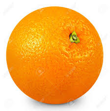
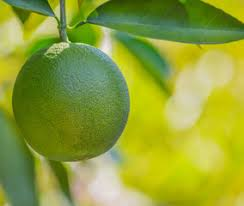
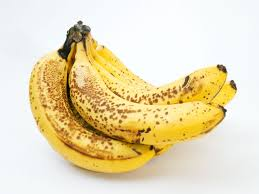
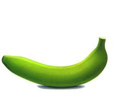
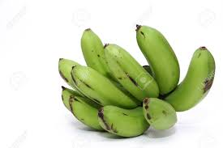
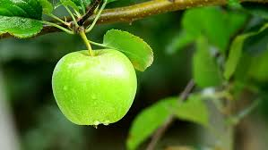
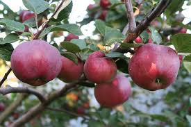
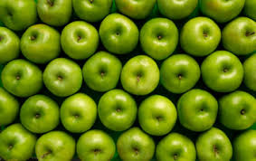

# Orangelib

This is the official github repository of Orangelib.. Orangelib is a library built to simplify the implementation of computer vision in real problems. It is a library for classifying oranges, apples and bananas. 

The models for classifying oranges, bananas and apples are trained with MobilleNetV2. Both the trained models and the dataset used in training the model are available as releases in this repository.

Install Orangelib with:

**pip install orangelib**

*Implementing OrangeClassifier With Orangelib

# Implementing Orangeclassifier With Orangelib:

Orangeclassifier is used to classify ripe and unripe oranges.

## The code to implement the classification of a single image with orangelib:
```
from orangelib.model import OrangeClassifier

classifier = OrangeClassifier("trained_model.h5")

fruit_name, confidence = classifier.predict("path_to_image")

print(" Fruit Name: ",fruit_name)
print("Prediction Confidence: ",confidence)
```
Looking into each line of code: 
```
from orangelib.model import OrangeClassifier
```

*We import in the class for classifying oranges from orangelib*

```
classifier = OrangeClassifier("trained_model.h5")
```

The path to model used for classifying oranges is loaded.
```
fruit_name, confidence = classifier.predict("path_to_image")
```

*The path to image to be predicted is loaded*
```
print(" Fruit Name: ",fruit_name)
print("Prediction Confidence: ",confidence)
```

*The fruit name and the level of confidence of the class predicted are printed out*


*orange_sample1*



```
fruit_name, confidence = classifier.predict("photos/sample1.jpg")
```

*output1*
```
Fruit Name:  unripe orange
Prediction Confidence: 99.92031 
```

*orange_sample2*


```
fruit_name, confidence = classifier.predict("photos/sample2.jpg")
```

*output2*
```
Fruit Name:  ripe orange
Prediction Confidence: 99.99995 
```


*orange_sample3*


```
fruit_name, confidence = classifier.predict("photos/sample3.jpg")
```
*output3*
```
Fruit Name:  ripe orange
Prediction Confidence: 99.99991 0.9999149
```

*orange_sample4*



```
fruit_name, confidence = classifier.predict("photos/sample4.jpg")
```
*output4*
```
Fruit Name:  unripe orange
Prediction Confidence: 99.99999
```

We may not to stress ourselves predicting a single image, when we intend to predict multiple images. 

*Code for implementing multiple predictions with Orangelib*

```

from orangelib.model import OrangeClassifier

classifier = OrangeClassifier("orange_model.h5")


fruit_names_list, confidence_list = classifier.predictBatch(["sample1.jpg","sample2.jpg","sample3.jpg", "sample4.jpg"])

for fruit_names, confidence in zip(fruit_names_list,confidence_list):
    print("Fruit Name: ",fruit_names)
    print("Prediction Confidence: ", confidence)
```
```
fruit_names_list, confidence_list = classifier.predictBatch(["sample1.jpg","sample2.jpg","sample3.jpg", "sample4.jpg"])
 ```
We perform predictions on an array of images using the *predictBatch function*

## Note:
There is no limit to the number of images that can be predicted using the *predictBatch function*


```
for fruit_names, confidence in zip(fruit_names_list,confidence_list):
    print("Fruit Name: ",fruit_names)
    print("Prediction Confidence: ", confidence)
```

We loop through the array of predictions and print it out the predictions for each of the images.
  
# Outputs:  


```
Fruit Name:  unripe orange
Prediction Confidence: 99.92031 

Fruit Name:  ripe orange
Prediction Confidence: 99.99995

Fruit Name:  ripe orange
Prediction Confidence: 99.99991

Fruit Name:  unripe orange
Prediction Confidence: 99.99999
```

It gives the same level of predictions for the images just as when they were predicted individually.


We are able to classify ripe and unripe oranges with over 99percent accuracy.


# Implementing BananaClassifier With Orangelib:

Bananaclassifier is used to classify ripe and unripe bananas.


*banana_sample1*



## The code to implement the classification of a single banana image with orangelib:

```
from orangelib.model import BananaClassifierClassifier

classifier = BananaClassifier("banana_model.h5")

fruit_name, confidence = classifier.predict("bananas/sample5.jpg")

print(" Fruit Name: ",fruit_name)
print("Prediction Confidence: ",confidence)
```
Little modifications to the code are:
We import in the class BananaClassifier from Orangelib and load the trained banana model.

*Output1*

```
Fruit Name:  ripe banana
Prediction Confidence:  99.99983
```
*banana_sample2*



```
fruit_name, confidence = classifier.predict("bananas/sample6.jpg")
```

*output2*
```
Fruit Name:  unripe banana
Prediction Confidence:  99.87182
```


*banana_sample3*


```
fruit_name, confidence = classifier.predict("bananas/sample7.jpg")
```
*output3*
```
Fruit Name:  ripe banana
Prediction Confidence:  99.99490
```

*banana_sample4*



```
fruit_name, confidence = classifier.predict("bananas/sample8.jpg")
```
*output4*
```
Fruit Name:  unripe banana
Prediction Confidence:  99.99660
```


*Code for implementing multiple predictions with Orangelib Using BananaClassifier*

```

from orangelib.model import BananaClassifier

classifier = OrangeClassifier("banana_model.h5")


fruit_names_list, confidence_list = classifier.predictBatch(["banana/sample5.jpg","bananas/sample6.jpg","bananas/sample7.jpg", "banana/sample8.jpg"])

for fruit_names, confidence in zip(fruit_names_list,confidence_list):
    print("Fruit Name: ",fruit_names)
    print("Prediction Confidence: ", confidence)
```
```
fruit_names_list, confidence_list = classifier.predictBatch(["bananas/sample5.jpg","bananas/sample6.jpg","bananas/sample7.jpg", "bananas/sample8.jpg"])
 ```
We perform predictions on an array of images using the *predictBatch function*.


```
for fruit_names, confidence in zip(fruit_names_list,confidence_list):
    print("Fruit Name: ",fruit_names)
    print("Prediction Confidence: ", confidence)
```

We loop through the array of predictions and print it out the predictions for each of the images.
  
# Outputs:  


```
Fruit Name:  ripe banana
Prediction Confidence:  99.99983

Fruit Name:  unripe banana
Prediction Confidence:  99.87182


Fruit Name:  ripe banana
Prediction Confidence:  99.99490


Fruit Name:  unripe banana
Prediction Confidence:  99.99660

```

It gives the same level of predictions for the images just as when they were predicted individually.


We are able to classify ripe and unripe bananas with over 99percent accuracy.


# Implementing AppleClassifier With Orangelib:

Appleclassifier is used to classify green and red apples.


*apple_sample1*



## The code to implement the classification of a single banana image with orangelib:

```
from orangelib.model import AppleClassifier

classifier = AppleClassifier("apple_model.h5")

fruit_name, confidence = classifier.predict("apples/sample3.jpg")

print(" Fruit Name: ",fruit_name)
print("Prediction Confidence: ",confidence)
```
Little modifications to the code are:
We import in the class AppleClassifier from Orangelib and load the trained apple model.

*Output1*

```
Fruit Name:  green apple
Prediction Confidence:  99.94303
```
*apple_sample2*



```
fruit_name, confidence = classifier.predict("apples/sample6.jpg")
```

*output2*
```
Fruit Name: red apple
Prediction Confidence:  100.0

```


*apple_sample3*



```
fruit_name, confidence = classifier.predict("apples/sample7.jpg")
```
*output3*
```
Fruit Name:  green apple
Prediction Confidence:  99.88158
```

*apple_sample4*


```
fruit_name, confidence = classifier.predict("apples/sample8.jpg")
```
*output4*
```
FruitName:red apple
Prediction Confidence: 100.0

```


*Code for implementing multiple predictions with Orangelib Using AppleClassifier*

```

from orangelib.model import AppleClassifier

classifier = AppleClassifier("apple_model.h5")


fruit_names_list, confidence_list = classifier.predictBatch(["apples/sample3.jpg","apples/sample6.jpg","apples/sample7.jpg", "apples/sample8.jpg"])

for fruit_names, confidence in zip(fruit_names_list,confidence_list):
    print("Fruit Name: ",fruit_names)
    print("Prediction Confidence: ", confidence)
```
```
fruit_names_list, confidence_list = classifier.predictBatch(["bananas/sample5.jpg","bananas/sample6.jpg","bananas/sample7.jpg", "bananas/sample8.jpg"])
 ```
We perform predictions on an array of images using *predictBatch function*


```
for fruit_names, confidence in zip(fruit_names_list,confidence_list):
    print("Fruit Name: ",fruit_names)
    print("Prediction Confidence: ", confidence)
```

We loop through the array of predictions and print it out the predictions for each of the images.
  
# Outputs:  


```
Fruit Name:  green apple
Prediction Confidence:  99.91635084152222


Fruit Name:  red apple
Prediction Confidence:  100.0

Fruit Name:  green apple
Prediction Confidence:  99.88158941268921

FruitName:red apple
Prediction Confidence: 100.0

```

It gives the same level of predictions for the images just as when they were predicted individually.


We are able to classify green apples with over 99percent surprisingly! It classified the red apples with 100% accuracy.


