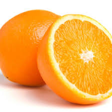
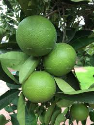

# Orangelib

Oranges_classifier is the github repository hosting orangelib. Orangelib is a library built to simplify the implementation of computer vision in real problems. It is a library for classifying oranges into two classes: ripe and uripe. 

The model for classifying oranges is trained with MobilleNetV2. Both the trained model and the dataset used in training the model are available as releases in this repository.

Install Orangelib with:

**pip install orangelib**

## The code to implement the classification of oranges with orangelib:
```
from orangelib.model import OrangeClassifier

classifier = OrangeClassifier("trained_model.h5")

fruit_name, confidence = classifier.predict("path_to_image")

print(" Fruit Name: ",fruit_name)
print("Prediction Confidence: ",confidence)
```
Looking into each line of code: 
```
from orangelib.model import OrangeClassifier
```

*We import in the class for classifying oranges from orangelib*

```
classifier = OrangeClassifier("trained_model.h5")
```

The path to model used for classifying oranges is loaded.
```
fruit_name, confidence = classifier.predict("path_to_image")
```

*The path to image to be predicted is loaded*
```
print(" Fruit Name: ",fruit_name)
print("Prediction Confidence: ",confidence)
```

*The fruit name and the level of confidence of the class predicted are printed out*

We shall test the library by performing inference on eight images:

*sample1*


```
fruit_name, confidence = classifier.predict("sample1.jpg")
```

*output1*
```
Fruit Name:  ripe orange
Prediction Confidence:  0.9945345
```

*sample2*


```
fruit_name, confidence = classifier.predict("sample2.jpg")
```

*output2*
```
Fruit Name:  unripe orange
Prediction Confidence:  0.99920315
```

*sample3*


```
fruit_name, confidence = classifier.predict("sample3.jpg")
```

*output3*
```
Fruit Name:  ripe orange
Prediction Confidence:  0.9999521
```

*sample4*


```
fruit_name, confidence = classifier.predict("sample4.jpg")
```
*output4*
```
Fruit Name:  unripe orange
Prediction Confidence:  0.9944437
```

*sample5*


```
fruit_name, confidence = classifier.predict("sample5.jpg")
```
*output5*
```
Fruit Name:  ripe orange
Prediction Confidence:  0.9999149
```

*sample6*


```
fruit_name, confidence = classifier.predict("sample6.jpg")
```
*output6*
```
Fruit Name:  unripe orange
Prediction Confidence:  0.99999917
```

*sample7*



```
fruit_name, confidence = classifier.predict("sample7.jpg")
```
*output7*
```
Fruit Name:  ripe orange
Prediction Confidence:  0.9983358
```

*sample8*



```
fruit_name, confidence = classifier.predict("sample8.jpg")
```
*output8*
```
Fruit Name:  unripe orange
Prediction Confidence:  0.9988331
```

# Excellent Result!
We are able to classify ripe and unripe oranges with over 99percent accuracy.

***Install the libraru and test it with as many samples as you wish***


