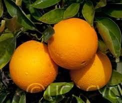
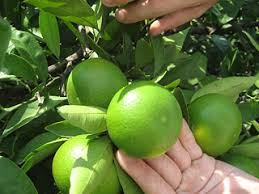

# Orangelib

This is the official github repository of Orangelib.. Orangelib is a library built to simplify the implementation of computer vision in real problems. It is a library for classifying oranges, apples and bananas. 

The models for classifying oranges, bananas and apples are trained with MobilleNetV2. Both the trained models and the dataset used in training the model are available as releases in this repository.

Install Orangelib with:

**pip install orangelib**
# Implementing Orangeclassifier With Orangelib:

Orangeclassifier is used to classify ripe and unripe oranges.

## The code to implement the classification of a single image with orangelib:
```
from orangelib.model import OrangeClassifier

classifier = OrangeClassifier("trained_model.h5")

fruit_name, confidence = classifier.predict("path_to_image")

print(" Fruit Name: ",fruit_name)
print("Prediction Confidence: ",confidence)
```
Looking into each line of code: 
```
from orangelib.model import OrangeClassifier
```

*We import in the class for classifying oranges from orangelib*

```
classifier = OrangeClassifier("trained_model.h5")
```

The path to model used for classifying oranges is loaded.
```
fruit_name, confidence = classifier.predict("path_to_image")
```

*The path to image to be predicted is loaded*
```
print(" Fruit Name: ",fruit_name)
print("Prediction Confidence: ",confidence)
```

*The fruit name and the level of confidence of the class predicted are printed out*


*sample1*


```
fruit_name, confidence = classifier.predict("sample2.jpg")
```

*output1*
```
Fruit Name:  unripe orange
Prediction Confidence: 99.92031 
```

*sample2*


```
fruit_name, confidence = classifier.predict("sample3.jpg")
```

*output2*
```
Fruit Name:  ripe orange
Prediction Confidence: 99.99995 
```


*sample3*



```
fruit_name, confidence = classifier.predict("sample5.jpg")
```
*output3*
```
Fruit Name:  ripe orange
Prediction Confidence: 99.99991 0.9999149
```

*sample4*



```
fruit_name, confidence = classifier.predict("sample6.jpg")
```
*output4*
```
Fruit Name:  unripe orange
Prediction Confidence: 99.99999
```

We may not to stress ourselves predicting a single image, when we intend to predict multiple images. 

*Code for implementing multiple predictions with Orangelib*

```

from orangelib.model import OrangeClassifier

classifier = OrangeClassifier("orange_model.h5")


fruit_names_list, confidence_list = classifier.predictBatch(["sample1.jpg","sample2.jpg","sample3.jpg", "sample4.jpg"])

for fruit_names, confidence in zip(fruit_names_list,confidence_list):
    print("Fruit Name: ",fruit_names)
    print("Prediction Confidence: ", confidence)# Excellent Result!
```
```
fruit_names_list, confidence_list = classifier.predictBatch(["sample1.jpg","sample2.jpg","sample3.jpg", "sample4.jpg"])
 ```
We perform predictions on an array of images.
We are able to classify ripe and unripe oranges with over 99percent accuracy.


